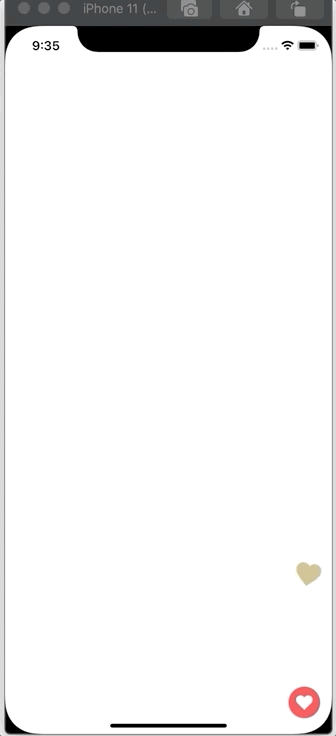

# react-native-flying-hearts

 flying hearts animation for React Native.



## Installation

```sh
npm install react-native-flying-hearts
```

## Usage

```js
import * as React from 'react';
import { StyleSheet, View } from 'react-native';
import FlyingHearts from "react-native-flying-hearts";

export default function App() {
  return (
    <View style={styles.container}>
      <FlyingHearts />
    </View>
  );
}
const styles = StyleSheet.create({
  container: {
    flex: 1
  },
});

```

### Props

| Props name        | Type      | Description                               | Default |
| ----------------- | --------- | ----------------------------------------- | ------- |
| style             | ViewStyle | Layout                                    |         |
| renderCustomShape | Function  | Renders a custom shape instead of a heart |         |


## Contributing

See the [contributing guide](CONTRIBUTING.md) to learn how to contribute to the repository and the development workflow.

## License

MIT
